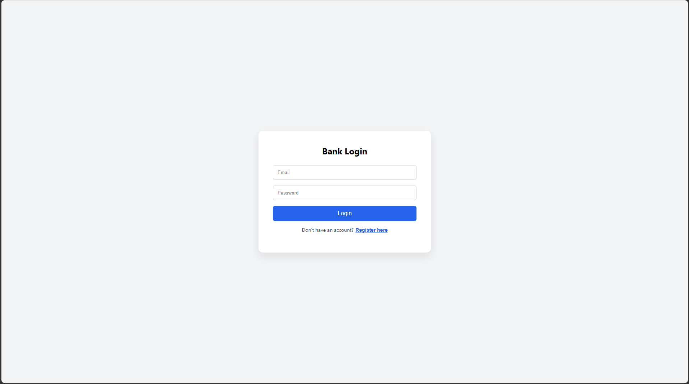
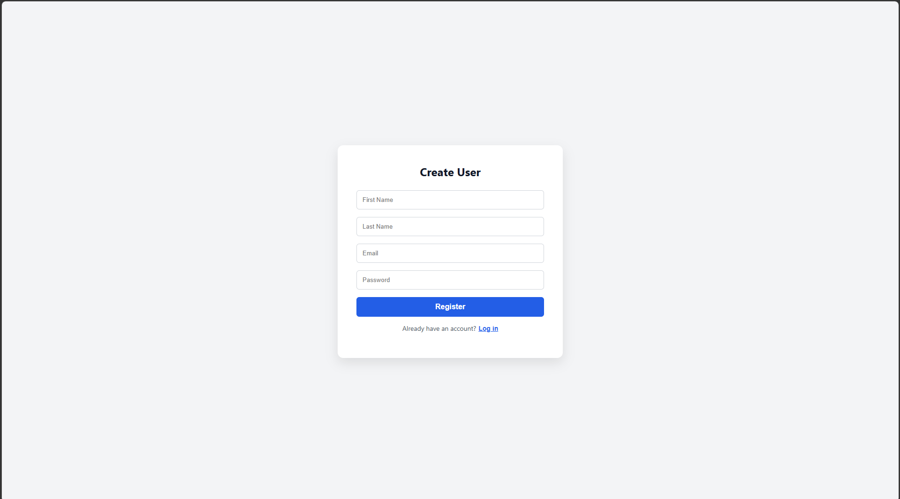
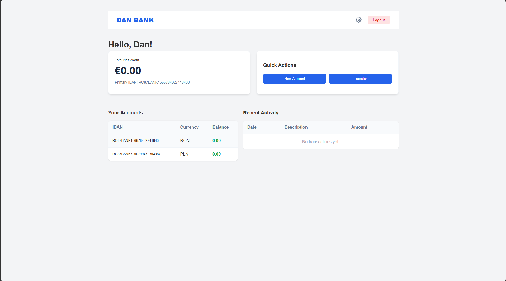
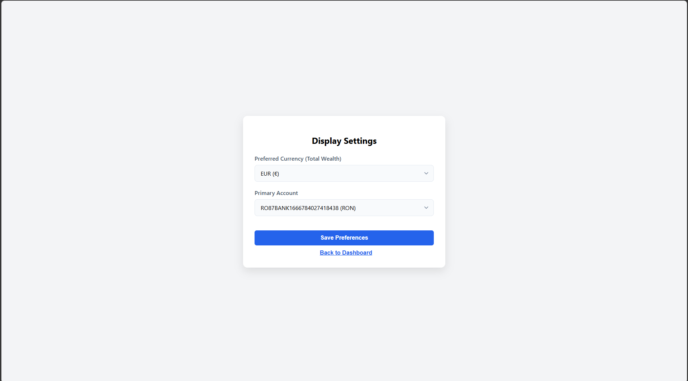
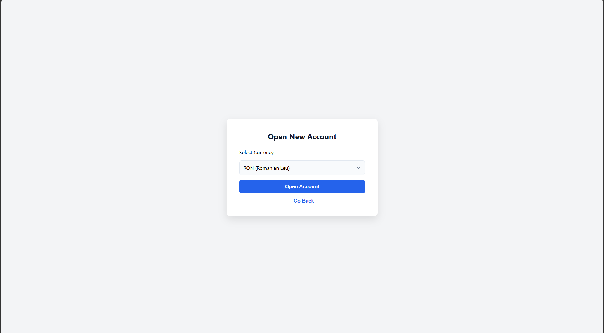
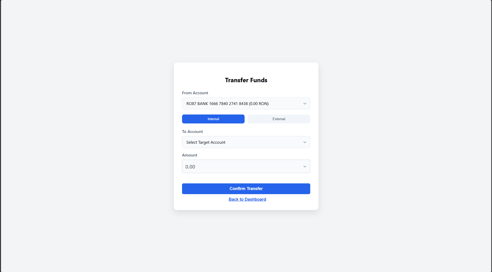

# DAN BANK — Banking Simulation Web App

A full-stack banking simulation application built as a portfolio/CV project. Users can register, manage multiple currency accounts, perform transfers, and track transaction history — all backed by a live cloud database.

**🌐 Live Demo:** [dannutz26.github.io/banking-system](https://dannutz26.github.io/banking-system)

---

## Screenshots

| Login | Register |
|-------|----------|
|  |  |

| Dashboard | Settings |
|-----------|----------|
|  |  |

| Open Account | Transfer Funds |
|--------------|----------------|
|  |  |

---

## Features

- **User authentication** — register and login with email and password
- **Multi-currency accounts** — open accounts in RON, EUR, USD, GBP, PLN and more
- **Fund transfers** — internal transfers between your own accounts and external transfers by IBAN
- **Real-time currency conversion** — live exchange rates via CurrencyAPI
- **Transaction history** — full log of all past transfers with date, description and amount
- **Display settings** — set a preferred currency for total wealth display and a primary account
- **Audit logging** — server-side logging of all user actions
- **Offline currency fallback** — hardcoded exchange rate table used automatically if the live CurrencyAPI is unavailable, ensuring transfers never fail due to third-party downtime
- **Smart currency caching** — exchange rates are cached in the database and automatically refreshed via API when stale; fallback to cached rates if the API limit is reached (rate refresh currently runs on-demand due to free tier API limits)

---

## Tech Stack
- Fault-tolerant currency conversion with live API + static fallback table

### Frontend
- React 19
- Axios
- CSS (custom styling)
- Hosted on **GitHub Pages**

### Backend
- Java 21
- Spring Boot 4
- Spring Data JPA / Hibernate
- RESTful API
- Dockerized and hosted on **Render.com**

### Database
- PostgreSQL (hosted on **Supabase**)

### DevOps
- Docker
- GitHub Actions (CI/CD — auto deploys frontend on push to main)
- Render (auto deploys backend on push to main)

---

## Architecture

```
GitHub Pages          Render.com (Docker)       Supabase
  React Frontend  →   Spring Boot Backend   →   PostgreSQL DB
```

---

## Running Locally

### Prerequisites
- Java 21
- Node.js 18+
- Maven
- PostgreSQL (local) or a Supabase project

### Setup

1. Clone the repo:
```bash
git clone https://github.com/dannutz26/banking-system.git
cd banking-system
```

2. Create `backend/src/main/resources/application-local.properties`:
```properties
spring.datasource.url=jdbc:postgresql://localhost:5432/banking_system
spring.datasource.username=your_db_user
spring.datasource.password=your_db_password
spring.jpa.hibernate.ddl-auto=update
currencyapi.api.key=your_currency_api_key
```

3. Install frontend dependencies:
```bash
cd frontend
npm install
```

4. Run the full app:
```bash
cd ..
npm run dev
```

The frontend runs on `http://localhost:3000` and the backend on `http://localhost:8080`.

---

## Project Structure

```
banking-system/
├── backend/                  # Spring Boot application
│   ├── src/main/java/        # Java source code
│   │   └── com/dan/banking/
│   │       ├── config/       # CORS, security config
│   │       ├── controller/   # REST controllers
│   │       ├── model/        # JPA entities
│   │       ├── repository/   # Spring Data repositories
│   │       └── service/      # Business logic
│   └── src/main/resources/   # application.properties
├── frontend/                 # React application
│   └── src/
│       └── components/       # React components
├── .github/workflows/        # GitHub Actions CI/CD
├── Dockerfile                # Docker config for backend
└── README.md
```

---

## Deployment Notes

- Frontend auto-deploys to GitHub Pages via GitHub Actions on every push to `main`
- Backend auto-deploys to Render via Docker on every push to `main`
- Backend kept alive 24/7 using a cron job pinging every 10 minutes, bypassing Render free tier cold starts
- Secrets managed via environment variables — never committed to the repo

---

## Known Limitations

- Currency exchange rates are cached and may not reflect real-time values — automatic refresh is throttled due to free tier API limits
- Backend hosted on Render free tier — cold start latency bypassed using a cron job (cron-job.org) that pings the server every 10 minutes to keep it alive

---

## Author

**Pop Alexandru Dan**  
[LinkedIn](https://www.linkedin.com/in/dan-pop-60a03929a/) · [GitHub](https://github.com/dannutz26)

---

## License

This project is open source and available under the [MIT License](LICENSE).